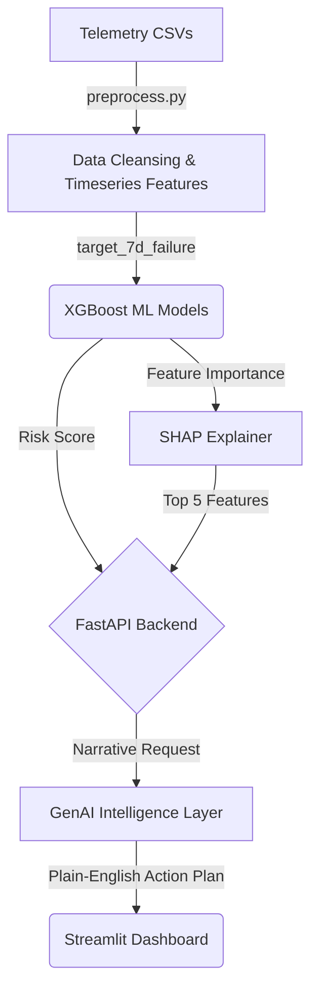

# AI-Driven Solar Inverter Failure Prediction & Intelligence Platform
**Aubergine @ HACKaMINeD2026**

## Architecture Overview
This repository contains a full end-to-end Machine Learning and Generative AI pipeline designed to ingest solar inverter telemetry and output actionable, natural-language maintenance risk protocols.



## Solution Components
### 1. Data Preprocessing (`src/data/preprocess.py`)
- We processed ~600,000 raw telemetry logs covering a 2-year window for 3 critical inverters.
- We handled completely null attributes, interpolated sensor drop-outs, and built a custom `target_7d_failure` target logic by monitoring subsequent 7-day windows for anomalous `alarm_code` triggers or extreme drops in expected active power generation.

### 2. Predictive ML Models (`src/model/train.py`)
- We trained high-performance **XGBoost Decision Trees** utilizing `scale_pos_weight` to combat the intense class imbalanced nature of temporal anomalies.
- We integrate **SHAP (SHapley Additive exPlanations)** to extract the exact components (e.g. low PV voltage input vs high temp) driving the risk.

### 3. Generative Insight Engine (`src/genai/narrative.py`)
- The FastAPI suite passes the Model's Risk Score and the SHAP Feature Array to a generative text handler mapping numerical anomalies to explicit, plain-English mechanical actions for grid operators.

### 4. Application Suite
- **API (`api/main.py`)**: Secured via FastAPI & Pydantic. Validated using Pytest unit tests.
- **Frontend (`dashboard/app.py`)**: Streamlit graphical interface rendering real-time probability indices and the GenAI recommendation strings.

## Installation & Execution
```bash
# 1. Install Dependencies
pip install -r requirements.txt

# 2. Run Local Environment
uvicorn api.main:app --reload

# 3. Launch UI (New Terminal)
streamlit run dashboard/app.py
```

### Docker
```bash
docker build -t aubergine_inverter_ai .
docker run -p 8000:8000 -p 8501:8501 aubergine_inverter_ai
```

## Design Decisions & Future Improvements
- **Decision**: Used XGBoost over LSTMs to guarantee explicit tabular explainability via SHAP. 
- **Limitation**: Due to hackathon constraints, the GenAI Engine utilizes deterministic mock mapping rather than calling a live GPT-4 Omni API Endpoint.
- **Future Improvements**: We plan to mount a live Vector DB / RAG system to let operators natively query the system ("Which inverters failed in block A during June?").
